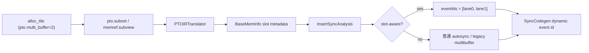

# PTOAS InsertSync Multibuffer 支持机制

本文围绕三个核心问题展开：multibuffer 如何表达、slot 如何识别、event id 如何按 slot 分配。

---

## 1. 问题的背景：ping/pong 优化带来的同步新需求

自动同步的基础问题是 producer 和 consumer 是否访问同一底层内存。
multibuffer 引入以后，同一个逻辑 tile buffer 会被拆成多个物理 slot，典型形态是 ping/pong：

- 当前迭代使用 `ping` 做搬运或计算。
- 下一迭代切换到 `pong`。
- 两个 slot 在物理地址上不重叠，但语义上属于同一个循环流水缓冲区。

这会带来两个容易混淆的问题：

- 如果只按同一个 root buffer 看待，会把 ping 和 pong 误认为互相依赖，插入过多同步。
- 如果只按两个地址看待，又无法覆盖用户手工用 `pto.subset` 或 `memref.subview` 从同一块 workspace 切 ping/pong 的写法。

因此，multibuffer 的自动同步不能只依赖原来的地址区间分析，还需要在 `BaseMemInfo` 上补充 slot 语义：它们是否来自同一逻辑 multibuffer root、属于哪个 slot、factor 是多少。

---

## 2. 目标和非目标

本设计的目标是支持 `Subset V1`，同时保持已有自动生成 multibuffer 路径不回归：

1. 用户可以在同一根 tile workspace 上标记 `pto.multi_buffer = 2`。
2. 用户可以通过 `pto.subset` 或 lowering 后的 `memref.subview` 切出 ping/pong。
3. `PTOInsertSync` 能识别这两个 slice 是同一 multibuffer root 下的两个 slot。
4. event id 分配可以为 ping/pong 提供稳定的 slot-local dynamic event lane。
5. 当几何关系无法静态证明时，必须回退到普通 autosync，保证正确性优先。

本设计明确不解决以下问题：

- 不新增 CLI 参数、Python API 或新的用户侧构造。
- 不支持 `pto.multi_buffer > 2` 的新语义。
- 不支持动态 offset、动态 size 或动态 stride 的 slot 证明。
- 不通过启发式推断两块独立 `pto.alloc_tile` 是一组 ping/pong。

最后一点很重要：两块独立 alloc tile 在 IR 上没有“同一逻辑缓冲区的 slot 0/1”这个不变量。编译器可以保守地保证同步正确性，但不能无条件把它们当作 multibuffer slot 来分配 dynamic event id。

---

## 3. 两种 multibuffer 表达：手工定义与自动生成

当前 PTOAS 中有两条 multibuffer 路径，它们解决的问题不同。

### 3.1 手工定义：`pto.multi_buffer=2` + `pto.subset/subview`

Subset V1 面向的是用户显式切分 workspace 的写法：

```mlir
%root = pto.alloc_tile ... {pto.multi_buffer = 2}
%ping = pto.subset %root offsets = [0, 0] sizes = [128, 256]
%pong = pto.subset %root offsets = [128, 0] sizes = [128, 256]
```

这里的用户契约是：

- `ping` 和 `pong` 必须来自同一个 root buffer。
- root buffer 必须带 `pto.multi_buffer = 2`。
- 两个 slice 必须静态可证明为非重叠、等大小、二等分。
- 只能沿一个维度切分，其他维度必须 full-span 或完全一致。

`PTOViewToMemref` 会把 `pto.multi_buffer` 属性从 `pto.alloc_tile` 传递到 lowering 后的 `memref.alloc`，并把 `pto.subset` lowering 成 `memref.subview + pto.bind_tile`。
因此 `PTOInsertSync` 同时识别原始 `pto.subset` 和 lowering 后的 `memref.subview`。

### 3.2 自动生成：`PTOPlanMemory` + `pointer_cast(addrs=[...])`

已有路径面向的是 PlanMemory 自动生成 multibuffer 的场景：

1. 用户或上游 pass 在局部 buffer 上标记 `pto.multi_buffer = 2`。
2. `PTOPlanMemory` 把它规划成两个物理 tile buffer。
3. IR 中出现 `pto.pointer_cast(addrs=[ping, pong])` 形态。
4. `EnableMultiBuffer` 后续把它改写成 loop-local 地址选择。

这条路径已经存在，InsertSync 的 legacy 逻辑通过 `baseAddresses.size() == 2` 识别 double-buffer 地址组。
Subset V1 不替换这条主路径，只是在 slot 元数据存在时优先使用 slot-aware 语义；否则继续走 legacy 逻辑。

### 3.3 不自动推断：两块独立 `alloc_tile`

下面这种写法目前不被当作 slot-aware multibuffer：

```mlir
%ping = pto.alloc_tile ...
%pong = pto.alloc_tile ...

scf.for ... {
  scf.if %is_ping {
    pto.tload ... outs(%ping)
    pto.tstore ins(%ping) ...
  } else {
    pto.tload ... outs(%pong)
    pto.tstore ins(%pong) ...
  }
}
```

原因不是这段 IR 一定不能正确同步，而是它缺少可证明的 group 语义：

- `%ping` 和 `%pong` 是两个独立 root。
- 编译器不知道它们是否必须按同一个 loop selector 交替使用。
- 编译器不知道是否还有其他路径把其中一块当作普通临时 buffer 使用。

因此当前策略是 correctness-first：把它们作为普通 buffer 分析，不强行给它们绑定同一个 dynamic event selector。
如果后续要正式支持这种写法，应该引入显式 group/slot 契约，例如 `pto.multi_buffer_group`、`pto.multi_buffer_slot`、`pto.multi_buffer_factor`，而不是依靠名字或控制流形态做启发式推断。

---

## 4. 流程并不复杂，但 slot 信息必须提前进入 `BaseMemInfo`

与 multibuffer 相关的关键阶段如下：

`PTOViewToMemref -> PTOPlanMemory -> PTOInsertSync -> EnableMultiBuffer -> PTOToEmitC`

其中 `PTOInsertSync` 内部仍然沿用原有流水线：

`PTOIRTranslator -> InsertSyncAnalysis -> MoveSyncState -> RemoveRedundantSync -> SyncEventIdAllocation -> SyncCodegen`

新增 slot-aware 语义主要落在三处：

1. `PTOIRTranslator`：从 `pto.subset/memref.subview` 计算 slot 元数据。
2. `InsertSyncAnalysis`：基于 slot 元数据决定一条 sync edge 需要几个 event id lane。
3. `SyncCodegen`：当 sync edge 有多个 event id 时，生成 dynamic event-id set/wait。

整体关系可以概括为：



---

## 5. 依赖识别：alias/range 仍是主体，slot 是额外语义

普通自动同步依赖 `BaseMemInfo` 上的四类基础信息：

- `rootBuffer`：底层分配源。
- `scope`：GM、L1、UB 等地址空间。
- `baseAddresses`：静态可知的地址或 offset。
- `allocateSize`：当前 view 的静态大小。

Subset V1 在此基础上增加以下字段：

- `multibufferRoot`：slot 所属的逻辑 multibuffer root。
- `multibufferSlot`：当前 view 属于哪个 slot，ping/pong 分别是 0/1。
- `multibufferFactor`：当前只支持 2。
- `isMultibufferSlotValid`：slot 元数据是否可用。
- `suppressLegacyMultibuffer`：该 root 已被证明不是合法 subset multibuffer 时，禁止半路回退到 legacy double-buffer。

注意：slot 元数据不替代 alias/range 分析。
RAW、WAR、WAW 依赖是否存在，仍然由原来的 def/use 和地址区间规则判定。slot 元数据只参与 event-id lane 数量和 loop/back-edge 相关的动态选择。

---

## 6. slot 识别：只接受静态可证明的 ping/pong 几何

`PTOIRTranslator::TryComputeSubsetSlotInfo` 只在以下条件全部满足时标记 slot：

1. 定义 op 是 `pto.subset` 或 `memref.subview`。
2. root buffer 带 `pto.multi_buffer = 2`，或者来自已有 legacy double-buffer root。
3. offset、size 都是静态整数。
4. `memref.subview` 的 stride 必须全为 1。
5. 所有维度都在 root shape 范围内。
6. 只有一个维度被切分，其他维度必须保持 full-span。
7. 被切分维度必须能被 2 等分。
8. 当前 slice size 必须正好等于该维度的一半。
9. offset 必须落在 slot 边界上，因此 slot 只能是 0 或 1。
10. root 的总静态字节数必须等于当前 slice 字节数的 2 倍。

满足这些条件后，translator 会写入：

```text
multibufferRoot   = root
multibufferSlot   = 0 or 1
multibufferFactor = 2
isMultibufferSlotValid = true
```

### 6.1 为什么失败时要按 root 失效

一个 root 下如果出现了非法 subset，例如两个 slice 重叠、不是二等分、或只识别到了其中一半，不能只让失败的那条 view 回退。
否则会出现一部分 use/def 带 slot 元数据，另一部分 use/def 没有 slot 元数据，event-id 分配可能半路进入 dynamic path。

因此当前策略是：

1. 如果 root-level subset multibuffer candidate 识别失败，标记整个 root invalid。
2. 清空该 root 下已记录的 slot 元数据。
3. 设置 `suppressLegacyMultibuffer = true`，避免 overlap 等负向用例又被 legacy `baseAddresses.size()==2` 当成合法 double-buffer。
4. 后续全部按普通 alias/range autosync 处理。

这条规则的目的不是优化，而是防止“半合法 multibuffer”生成错误 dynamic event id。

---

## 7. event id 分配：从地址组升级到 slot-aware edge

普通同步只需要一个 event id：

```text
set(MTE2 -> V, event_id = k)
wait(MTE2 -> V, event_id = k)
```

multibuffer ping/pong 需要两个 event lane：

```text
even iteration -> lane0
odd  iteration -> lane1
```

`InsertSyncAnalysis::GetEventIdNum` 的判断顺序是：

1. 如果依赖边两侧都带合法 slot 元数据，先走 slot-aware 判断。
2. 如果 slot-aware 判断证明所有依赖对都来自同一个 root、同一个 factor，且 slot 几何一致，则返回 `factor`，当前即 2。
3. 如果 slot 元数据不存在，再尝试已有 legacy double-buffer 判断。
4. 任一条件不满足，返回 1，按普通同步处理。

### 7.1 slot-aware 判断到底证明什么

对于一组依赖 pair，`IsSlotAwareMultibufferPair` 要证明：

- 两侧都不是 GM buffer。
- 两侧都带合法 slot 元数据。
- `multibufferRoot` 相同。
- `multibufferFactor` 相同。
- `multibufferSlot` 在 `[0, factor)` 范围内。
- 同 slot 的两个 view 必须地址重叠。
- 不同 slot 的两个 view 必须地址不重叠。

这组规则表达的是：同一个 slot 内的 producer/consumer 仍然需要同步，不同 slot 之间不制造伪依赖。

### 7.2 dynamic event-id 如何落代码

当一条 sync edge 分到了两个 event id，`SyncCodegen` 会调用 dynamic event-id 生成路径：

1. 找到该 sync 对应的 loop。
2. 构造 loop nest parity 条件。
3. 在偶数迭代选择 `eventIds[0]`。
4. 在奇数迭代选择 `eventIds[1]`。
5. 生成 `pto.set_flag_dyn` 或 `pto.wait_flag_dyn`。

伪代码如下：

```text
cond = (loop_parity == odd)
event = select cond, eventIds[1], eventIds[0]
set_flag_dyn(srcPipe, dstPipe, event)
wait_flag_dyn(srcPipe, dstPipe, event)
```

因此 ping 与 pong 拥有稳定的 slot-local event lane，loop 迭代交替时可以复用对应 slot 的 event id，而不是让两个 slot 竞争同一个静态 event。

---

## 8. 两条路径如何共存

Subset V1 和 legacy 自动生成 multibuffer 的优先级如下：

1. 如果 `BaseMemInfo` 已经带合法 `isMultibufferSlotValid`，优先走 slot-aware path。
2. 如果 slot-aware 不成立，且没有 `suppressLegacyMultibuffer`，再尝试 legacy `baseAddresses.size()==2` path。
3. 如果 root 被标记为 invalid subset multibuffer，直接禁用 legacy fallback。
4. 如果以上都不成立，回到单 event id 的普通 autosync。

这个顺序保证了三件事：

- 手工 subset/subview pingpong 能得到 dynamic event-id 支持。
- 旧的 `pointer_cast(addrs=[...])` 主路径不回归。
- 非法 subset 不会因为地址数量看起来像 double-buffer 而误进 multibuffer codegen。

---

## 9. 例子：合法 subset、非法 overlap、缺少属性

### 9.1 合法 subset ping/pong

```text
root shape = [256, 256]
ping offset = [0,   0], size = [128, 256]
pong offset = [128, 0], size = [128, 256]
```

识别结果：

- `ping.multibufferSlot = 0`
- `pong.multibufferSlot = 1`
- `multibufferFactor = 2`
- sync edge 可以分配两个 dynamic event lane。

### 9.2 非法 overlap

```text
root shape = [256, 256]
ping offset = [0,  0], size = [160, 256]
pong offset = [96, 0], size = [160, 256]
```

两个 slice 重叠，且不是二等分。
识别结果：

- 整个 root 被标记为 invalid subset multibuffer。
- 清空 slot 元数据。
- 禁用 legacy multibuffer fallback。
- 按普通 autosync 保守插同步。

### 9.3 合法切片但缺少 `pto.multi_buffer`

```text
root shape = [256, 256]
ping offset = [0,   0], size = [128, 256]
pong offset = [128, 0], size = [128, 256]
root has no pto.multi_buffer attribute
```

几何关系看起来像 ping/pong，但用户没有声明 multibuffer intent。
识别结果：

- 不标记 slot。
- 不进入 slot-aware event 分配。
- 按普通 autosync 处理。

这能避免普通 workspace 恰好被二等分时被误识别成 multibuffer。

---

## 10. 正确性原则

可以把当前实现归纳成三条不变量：

1. 没有显式 multibuffer intent，就不启用 slot-aware 语义。
2. 没有静态可证明的二等分非重叠几何，就不启用 slot-aware 语义。
3. 一旦某个 root 的 subset multibuffer 识别失败，该 root 下所有 view 都回退到普通 autosync。

这些不变量会牺牲一部分优化机会，但能保证不会因为误识别 multibuffer 而漏同步或错误复用 event id。

---

## 11. 测试与看护

本设计对应的看护用例覆盖三类场景：

- `test_inject_sync_multibuf_subset_pingpong.py`：合法 `pto.subset` + `pto.multi_buffer=2`，期望生成 slot-aware dynamic event-id 形态，并防止回退到 tile pointer-cast 风格 lowering。
- `test_inject_sync_multibuf_subset_overlap.py`：带 `pto.multi_buffer=2` 但 subset 重叠或不等分，期望只走普通 autosync，不进入 slot-aware multibuffer。
- `test_inject_sync_multibuf_subset_no_attr.py`：ping/pong 几何合法但缺少 `pto.multi_buffer`，期望仍走普通 autosync。

A3 上板最小用例为 `multibuffer_subset_pingpong_a3.py`。
它使用单输入单输出和确定性 golden/compare，用于验证 subset-based ping/pong lowering、自动同步插入、dynamic event-id codegen 和远端 NPU 执行链路。

---

## 12. 后续方向

后续优化主要有三条：

1. 扩展到 `pto.multi_buffer > 2`，把 factor 从 ping/pong 推广到 N-buffer。
2. 支持显式 group/slot 属性，让两块独立 `alloc_tile` 也能安全表达为同一 multibuffer group。
3. 在保持 correctness-first 的前提下，提高动态 shape/offset 场景下的 slot 证明能力。

其中第二条是支持独立 alloc ping/pong 的关键。
在没有显式 group/slot 契约前，编译器不应该仅凭变量名、if 分支或两块 buffer 大小相同就推断 multibuffer，因为这会把普通双缓冲临时变量误绑定到同一个 dynamic event selector 上。

---

## 13. 结论

Subset V1 的核心是把 multibuffer 从“两个地址”提升为“同一 root 下的两个 slot”。
依赖识别仍然保持原来的 alias/range correctness-first 策略，slot 元数据只在 event-id lane 统计和 dynamic event-id codegen 中生效。

这样既能覆盖用户手工 `pto.subset/memref.subview` 定义 ping/pong 的场景，又不会破坏已有 `PTOPlanMemory + pointer_cast(addrs=[...])` 自动生成 multibuffer 路径。遇到无法证明的几何关系时，系统统一回退到普通 autosync，以正确性优先。
