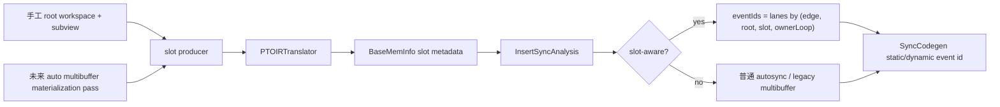

# PTOAS InsertSync Multibuffer 支持机制

本文围绕三个核心问题展开：multibuffer 如何表达、slot 如何识别、event id 如何按 slot 分配。
对未来需要扩展到多 group、多 slot 的场景，本文采用“共同 root workspace + group + slot”的建模方式；`family` 不作为用户可见 annotation，公共 root 本身就是隐式 family。

---

## 1. 问题的背景：ping/pong 优化带来的同步新需求

自动同步的基础问题是 producer 和 consumer 是否访问同一底层内存。
multibuffer 引入以后，同一个逻辑 tile buffer 会被拆成多个物理 slot，典型形态是 ping/pong：

- 当前迭代使用 `ping` 做搬运或计算。
- 下一迭代切换到 `pong`。
- 两个 slot 在物理地址上不重叠，但语义上属于同一个循环流水缓冲区。

这会带来两个容易混淆的问题：

- 如果只按同一个 root buffer 看待，会把 ping 和 pong 误认为互相依赖，插入过多同步。
- 如果只按地址不重叠看待，虽然能减少伪依赖，但仍然缺少“它们属于同一个 multibuffer group 的 slot 集合”这一层语义，因此无法把 event id 稳定绑定到槽位，也无法覆盖未来由 pass 自动物化 slot 的场景。

因此，multibuffer 的自动同步不能只依赖原来的地址区间分析，还需要在 `BaseMemInfo` 上补充 slot 语义：它们是否来自同一逻辑 multibuffer root、属于哪个 slot、factor 是多少，以及该槽位选择归属于哪个 loop。

---

## 2. 目标和非目标

本设计的目标是支持 `SubView V1`，同时保持已有自动生成 multibuffer 路径不回归：

1. 当前 V1 正式支持的用户契约是：用户先声明一块已经扩好的 root workspace，并在叶子 `pto.subview` 上显式标记 multibuffer factor/slot。
2. 当前 V1 对外暴露的 multibuffer intent 入口是 subview annotation，而不是 allocation-level annotation。
3. 用户可以通过 `pto.subview` 或 lowering 后的 `memref.subview` 切出多个 slot，并显式写出稳定的 slot 选择逻辑，例如 `%iv % factor` 的 round-robin 选择。
4. `PTOInsertSync` 能识别这些 slice 是同一 multibuffer root 下的多个 slot。
5. event id 分配可以为这些 slot 提供稳定的 slot-local event lane，并把具体 event id 绑定到槽位。
6. 当几何关系无法静态证明时，必须回退到普通 autosync，保证正确性优先。
7. 内部抽象要建立在 slot 语义上，而不是建立在 `pto.subview` 这一种语法上，为后续 annotation-driven 自动 multibuffer 留出演进空间。

本设计明确不解决以下问题：

- 不新增 CLI 参数、Python API 或新的用户侧构造。
- 当前显式 subview 路径只支持 `2 <= pto.multi_buffer_factor < 8`。
- 不支持动态 offset、动态 size 或动态 stride 的 slot 证明。
- 不通过启发式推断两块独立 `pto.alloc_tile` 是一组 ping/pong。
- 不在本 PR 中把单 buffer 自动扩成 ping/pong workspace，也不在本 PR 中自动改写计算通路的流水并行结构。
- 不把 `family` 作为用户必须书写的显式 annotation。

最后一点很重要：两块独立 alloc tile 在 IR 上没有“同一逻辑缓冲区的 slot 集合”这个不变量。编译器可以保守地保证同步正确性，但不能无条件把它们当作 multibuffer slot 来分配 dynamic event id。

---

## 3. 当前 V1 的用户契约、已有路径与未来演进

当前 PTOAS 中有两条与 multibuffer 相关的路径，它们解决的问题不同。V1 要正式支持的是“用户显式声明 slot”的路径，同时保持已有 legacy 自动生成路径不回归。

### 3.1 手工定义：subview annotation + `pto.subview/memref.subview`

SubView V1 面向的是用户显式切分 workspace 的写法：

```mlir
%root = pto.alloc_tile ...
%slot0 = pto.subview %root[%c0, %c0] sizes [128, 256]
  {pto.multi_buffer_factor = 3, pto.multi_buffer_slot = 0}
  : !pto.tile_buf<...> -> !pto.tile_buf<...>
%slot1 = pto.subview %root[%c128, %c0] sizes [128, 256]
  {pto.multi_buffer_factor = 3, pto.multi_buffer_slot = 1}
  : !pto.tile_buf<...> -> !pto.tile_buf<...>
%slot2 = pto.subview %root[%c256, %c0] sizes [128, 256]
  {pto.multi_buffer_factor = 3, pto.multi_buffer_slot = 2}
  : !pto.tile_buf<...> -> !pto.tile_buf<...>
```

这里的用户契约是：

- 所有 slot subview 必须来自同一个 root buffer。
- 每个参与 multibuffer 的 leaf subview 都必须显式带 `pto.multi_buffer_factor` 和 `pto.multi_buffer_slot`。
- `pto.multi_buffer_factor` 是用户显式契约，当前支持 `2 <= factor < 8`，不做内部默认或按叶子数量反推。
- 所有 slot slice 必须静态可证明为非重叠、等大小、单维等分。
- 只能沿一个维度切分，其他维度必须 full-span 或完全一致。
- loop 中必须存在稳定的 slot 选择逻辑，例如 `%iv % factor` 对应 round-robin 选择。
- 用户只负责表达 workspace、slot 和选择逻辑；自动同步和 event id 插入仍然由 PTOAS 完成。

`PTOViewToMemref` 会把这些 multibuffer attrs 从 `pto.subview` 传递到 lowering 后的 `memref.subview`，并把 `pto.subview` lowering 成 `memref.subview + pto.bind_tile`。
因此 `PTOInsertSync` 同时识别原始 `pto.subview` 和 lowering 后的 `memref.subview`。

### 3.2 自动生成：`PTOPlanMemory` + `pointer_cast(addrs=[...])`

已有路径面向的是 PlanMemory 自动生成 multibuffer 的场景：

1. 用户或上游 pass 在局部 buffer 上标记 `pto.multi_buffer = 2`，作为 legacy/internal multibuffer intent。
2. `PTOPlanMemory` 把它规划成两个物理 tile buffer。
3. IR 中出现 `pto.pointer_cast(addrs=[ping, pong])` 形态。
4. `EnableMultiBuffer` 后续把它改写成 loop-local 地址选择。

这条路径已经存在，InsertSync 的 legacy 逻辑通过 `baseAddresses.size() == 2` 识别 double-buffer 地址组。
SubView V1 不替换这条主路径，只是在 slot 元数据存在时优先使用 slot-aware 语义；否则继续走 legacy 逻辑。

### 3.3 不自动推断：两块独立 `alloc_tile`

下面这种写法目前不被当作 slot-aware multibuffer：

```mlir
%ping = pto.alloc_tile ...
%pong = pto.alloc_tile ...

scf.for ... {
  scf.if %is_ping {
    pto.tload ... outs(%ping)
    pto.tstore ins(%ping) ...
  } else {
    pto.tload ... outs(%pong)
    pto.tstore ins(%pong) ...
  }
}
```

原因不是这段 IR 一定不能正确同步，而是它缺少可证明的 group 语义：

- `%ping` 和 `%pong` 是两个独立 root。
- 编译器不知道它们是否必须按同一个 loop selector 交替使用。
- 编译器不知道是否还有其他路径把其中一块当作普通临时 buffer 使用。

因此当前策略是 correctness-first：把它们作为普通 buffer 分析，不强行给它们绑定同一个 dynamic event selector。
如果后续要正式支持这种写法，更合理的方向不是让 `InsertSync` 直接跨两个独立 root 猜测它们属于同一组，而是新增前置 normalization/materialization pass，先把它们统一改写成“共同 root workspace + 叶子 group/slot”的标准形态，再复用同一套 slot-aware autosync。

### 3.4 当前显式 annotation 契约：共同 root + 叶子 group/slot

对于多 group、多 slot 的用户手工写法，设计收敛后的显式契约应当是：

```mlir
%workspace = pto.alloc_tile ...

%group0_slot0 = pto.subview %workspace[...] sizes [...]
  {pto.multi_buffer_factor = 3, pto.multi_buffer_group = 0, pto.multi_buffer_slot = 0}
%group0_slot1 = pto.subview %workspace[...] sizes [...]
  {pto.multi_buffer_factor = 3, pto.multi_buffer_group = 0, pto.multi_buffer_slot = 1}
%group1_slot0 = pto.subview %workspace[...] sizes [...]
  {pto.multi_buffer_factor = 3, pto.multi_buffer_group = 1, pto.multi_buffer_slot = 0}
```

这套契约表达的是：

1. 共同 root workspace 本身就是隐式 family，不再额外暴露 `pto.multi_buffer_family`。
2. `group` 是真正的同步/event lane 隔离域；不同 group 之间互不干扰。
3. `slot` 是 group 内的轮转索引。
4. `factor` 也可以直接跟着 leaf subview 一起标注；同组叶子之间必须保持一致。
5. 用户不需要额外书写 `selector` attr；默认选择语义仍然来自 IR 中显式写出的控制流，例如 `%iv % 3`。

当前实现已经支持这套 leaf-level 显式契约：

- 单 group 场景可以只标 `pto.multi_buffer_factor + pto.multi_buffer_slot`，`group` 默认视为 0。
- 多 group 共享同一个 root workspace 时，需要显式标 `pto.multi_buffer_group`，这样 autosync 才能把不同 group 当成独立的同步隔离域。
- 如果同一条 sync edge 下混入了多个 group，当前 V1 会保守回退到普通 autosync，不强行合并成一个 dynamic selector。

一个完整的 PTO 示例见 [multibuffer-root-group-slot-demo.pto](./multibuffer-root-group-slot-demo.pto)。

### 3.5 未来演进：从手工 slot 走向 annotation-driven 自动 multibuffer

当前 V1 不是“把单 buffer 自动扩成 ping/pong”，而是“用户先把 multibuffer workspace、factor 和 slot 显式写出来，autosync 再按 slot 分 event id”。

但这条路线并不妨碍未来升级。关键在于内部抽象必须建立在 slot 语义上，而不是建立在 `pto.subview` 这一种来源上：

1. 现在由 `pto.subview/memref.subview` 产生 slot 元数据。
2. 未来可以新增一个前置 multibuffer materialization pass，让用户只在 alloc/root 上标 multibuffer intent。
3. 该 pass 负责把单 buffer 或其他非标准 multibuffer 形态规范化成共同 root workspace、叶子 slot view 和稳定 selector，必要时再配合 loop/pipeline 改写。
4. `PTOInsertSync`、`SyncEventIdAllocation` 和 `SyncCodegen` 继续消费统一的 slot 元数据，不需要重新设计同步核心。

换句话说，手工 subview 只是当前 V1 的第一种 slot 来源，不应被当作 multibuffer 模型本身。

---

## 4. 流程并不复杂，但 slot 信息必须提前进入 `BaseMemInfo`

与 multibuffer 相关的阶段要分成两条路径来看：

1. legacy 自动生成路径：
   `PTOViewToMemref -> PTOPlanMemory -> PTOInsertSync -> EnableMultiBuffer -> PTOToEmitC`
2. 手工 slot / 未来 materialized slot 路径：
   `用户显式 root+subview 或前置 materialization pass -> PTOViewToMemref -> PTOPlanMemory -> PTOInsertSync -> PTOToEmitC`

这里需要特别强调：

- 现有 `EnableMultiBuffer` 不是通用 multibuffer materialization pass。
- 它当前只负责把 legacy `pto.pointer_cast(addrs=[ping, pong])` 改写成 loop-local 地址选择。
- 它不负责自动扩 root workspace、生成叶子 slot subview，也不负责自动改写计算通路。
- 对手工 slot / materialized slot 路径来说，`EnableMultiBuffer` 通常只是保持 no-op 或只处理其他 legacy 形态。

其中 `PTOInsertSync` 内部仍然沿用原有流水线：

`PTOIRTranslator -> InsertSyncAnalysis -> MoveSyncState -> RemoveRedundantSync -> SyncEventIdAllocation -> SyncCodegen`

当前 V1 中，slot 的直接来源是带显式 multibuffer attrs 的 `pto.subview/memref.subview`；未来如果新增自动 multibuffer materialization pass，它也应该产出同样的 slot 元数据。

新增 slot-aware 语义主要落在三处：

1. `PTOIRTranslator`：从 `pto.subview/memref.subview` 计算 slot 元数据。
2. `InsertSyncAnalysis`：基于 slot 元数据决定一条 sync edge 需要几个 event id lane。
3. `SyncCodegen`：当 sync edge 有多个 event id 时，生成 dynamic event-id set/wait。

整体关系可以概括为：



---

## 5. 依赖识别：alias/range 仍是主体，slot 是额外语义

普通自动同步依赖 `BaseMemInfo` 上的四类基础信息：

- `rootBuffer`：底层分配源。
- `scope`：GM、L1、UB 等地址空间。
- `baseAddresses`：静态可知的地址或 offset。
- `allocateSize`：当前 view 的静态大小。

SubView V1 在此基础上增加以下字段：

- `multibufferRoot`：slot 所属的逻辑 multibuffer root。
- `multibufferGroup`：slot 所属的 group；默认值为 0。
- `multibufferSlot`：当前 view 属于哪个 slot。
- `multibufferFactor`：当前 multibuffer 的显式 factor，SubView V1 支持 `2 <= factor < 8`。
- `isMultibufferSlotValid`：slot 元数据是否可用。
- `suppressLegacyMultibuffer`：该 root 已被证明不是合法 subview multibuffer 时，禁止半路回退到 legacy double-buffer。

注意：slot 元数据不替代 alias/range 分析。
RAW、WAR、WAW 依赖仍然由原来的 def/use 和地址区间规则主导；但对显式 multibuffer leaf，依赖分析现在会利用 `(root, group, slot)` 证明，把同 root 下静态可证明不重叠的 group/slot 伪依赖提前剪掉，避免父 stride 继承导致的扁平字节区间误判。slot 元数据随后继续参与 event-id lane 数量和 loop/back-edge 相关的动态选择。

这些字段的设计应保持 source-agnostic：当前可以由 subview 填充，未来也可以由自动 multibuffer 物化 pass、显式 group/slot annotation 或其他 view-like IR 产生。

---

## 6. slot 识别：只接受静态可证明的等分 multibuffer 几何

当前 V1 中，`PTOIRTranslator::TryComputeSubviewSlotInfo` 是第一种 slot producer。它只在以下条件全部满足时标记 slot：

1. 定义 op 是 `pto.subview` 或 `memref.subview`。
2. 当前 subview 带显式 `pto.multi_buffer_factor` / `pto.multi_buffer_slot`，或者来自已有 legacy double-buffer root。
3. offset、size 都是静态整数。
4. `memref.subview` 的 stride 必须是静态正整数；V1 允许 subview 继承父 tile 的静态 stride，不额外要求编译器把它规整成全 1。
5. 所有维度都在 root shape 范围内。
6. 只有一个维度被切分，其他维度必须保持 full-span。
7. `pto.multi_buffer_factor` 必须满足 `2 <= factor < 8`。
8. 被切分维度必须能被 `factor` 等分。
9. 当前 slice size 必须正好等于该维度的 `1 / factor`。
10. offset 必须落在 slot 边界上，因此 slot 必须落在 `[0, factor)`。
11. 如果 root 和 slice 的逻辑字节数都静态可知，则它们必须满足 `rootBytes == sliceBytes * factor`；这只是合法性一致性检查，不是 factor 的推断来源。

满足这些条件后，translator 会写入：

```text
multibufferRoot   = root
multibufferSlot   = slot index in [0, factor)
multibufferFactor = explicit factor
isMultibufferSlotValid = true
```

### 6.1 为什么失败时要按 root 失效

一个 root 下如果出现了非法 subview，例如两个 slice 重叠、不是 `factor` 等分、或只识别到了其中一半，不能只让失败的那条 view 回退。
否则会出现一部分 use/def 带 slot 元数据，另一部分 use/def 没有 slot 元数据，event-id 分配可能半路进入 dynamic path。

因此当前策略是：

1. 如果某个 root 下的 subview multibuffer candidate 识别失败，标记整个 root invalid。
2. 清空该 root 下已记录的 slot 元数据。
3. 设置 `suppressLegacyMultibuffer = true`，避免 overlap 等负向用例又被 legacy `baseAddresses.size()==2` 当成合法 double-buffer。
4. 后续全部按普通 alias/range autosync 处理。

这条规则的目的不是优化，而是防止“半合法 multibuffer”生成错误 dynamic event id。

---

## 7. event id 分配：从地址组升级到 slot-aware edge

普通同步只需要一个 event id：

```text
set(MTE2 -> V, event_id = k)
wait(MTE2 -> V, event_id = k)
```

multibuffer 需要 `factor` 个 event lane：

```text
slot0 -> lane0
slot1 -> lane1
...
slot(factor-1) -> lane(factor-1)
```

这里的 event lane 不是硬件 `EVENT_IDk` 本身，而是分析阶段的逻辑槽位通道。更一般地说，一条 multibuffer lane 应绑定到：

```text
(sync edge, multibuffer root, multibuffer group, slot index, ownerLoop)
```

`SyncEventIdAllocation` 再把这些逻辑 lane 映射成具体的硬件 event id。

`InsertSyncAnalysis::GetEventIdNum` 的判断顺序应当是：

1. 先证明一条 sync edge 是否真的拥有多个稳定 slot。
2. 如果能证明所有依赖对都来自同一个 root、同一个 group、同一个 factor，且 slot 几何一致，则返回 `factor`。
3. 如果不能证明，就返回 1，按普通同步处理。
4. 只有在 slot 元数据不存在时，才尝试已有 legacy double-buffer 判断。

这条顺序的核心不是“尽量多给两个 id”，而是“event id 必须先绑定到已证明的槽位，再决定是否扩张到多个 id”。

### 7.1 slot-aware 判断到底证明什么

对于一组依赖 pair，`IsSlotAwareMultibufferPair` 要证明：

- 两侧都不是 GM buffer。
- 两侧都带合法 slot 元数据。
- `multibufferRoot` 相同。
- `multibufferFactor` 相同。
- `multibufferSlot` 在 `[0, factor)` 范围内。
- slot proof 已经在 translator 阶段基于同一 logical root 的静态几何完成；analysis 不再要求把不同 slot 重新压平成线性地址区间再证明一次。
- 同 slot pair 在 analysis 中按“需要同步”保守处理，不同 slot pair 视为同一 root 下的不同 lane，不制造伪依赖。

这组规则表达的是：同一个 slot 内的 producer/consumer 仍然需要同步，不同 slot 之间不制造伪依赖。

### 7.2 slot 证明结果如何进入 codegen

一条 sync edge 被证明为 multibuffer 后，后续 codegen 还需要知道两件事：

1. 槽位选择是静态分支还是 loop selector。
2. 这个槽位选择真正归属于哪个 loop，而不是当前 op 最近的父循环。

因此 analysis 阶段应进一步沉淀最小元数据，例如：

- `slotMode`：`single / branch / selector`
- `slotCount`
- `ownerLoopBegin/End`

这些元数据的作用是让 `SyncCodegen` 消费已经证明过的槽位语义，而不是在 codegen 阶段重新猜。

### 7.3 static / dynamic event-id 如何落代码

分析阶段先决定一条 sync edge 究竟属于 `single`、`branch` 还是 `selector`：

1. `single` 路径只有一个 proven slot，直接生成静态 `set/wait`。
2. `branch` 路径表示 analysis 已经看到了多 slot 事实，但当前这条 sync edge 只落在某个 branch-local slot 上，且尚未证明这些互斥分支能合并成同一个 selector family；这类 edge 仍然保守生成静态 `set/wait`。
3. `selector` 路径要求 analysis 证明：一条 edge 真实跨越多个 slot，slot 选择明确归属于某个 `ownerLoop`，并且这些 slot 是同一个逻辑 stage 的互斥版本。
4. 这一步不要求用户必须写 `scf.if -> result` 这种特殊 selector 语法。对普通 `if/else` 写法，只要 analysis 能在共同分支树中恢复出 factor-complete 的 branch family，也会提升成 `selector`。
5. `selector` 的动态 event-id 选择逻辑是 `eventIds[slotSelector]`；当前默认 selector 语义是 owner-loop 上的 round-robin `%iv % factor`。
6. 只有 `selector` 走 `pto.set_flag_dyn` 或 `pto.wait_flag_dyn`。

伪代码如下：

```text
slot = loop_iteration % factor
event = eventIds[slot]
set_flag_dyn(srcPipe, dstPipe, event)
wait_flag_dyn(srcPipe, dstPipe, event)
```

因此每个 slot 都拥有稳定的 slot-local event lane。对无法提升为 selector family 的 branch-local slot，编译器会保守地静态绑定 event id；而对已经证明属于同一 loop selector 的 ping/pong 或 N-buffer family，loop 迭代轮转时会复用对应 slot 的 dynamic event id。

这条规则的关键不是“只要在 loop 里就用内部默认值”，而是“只有当 slot 选择已被证明属于该 loop 时，才能把动态 event 绑定到该 loop 上”；而 factor 仍然必须来自用户显式 annotation，而不是由编译器内部默认或按叶子数量反推。否则必须保守退回单 id。

---

## 8. 两条路径如何共存

SubView V1 和 legacy 自动生成 multibuffer 的优先级如下：

1. 如果 `BaseMemInfo` 已经带合法 `isMultibufferSlotValid`，优先走 slot-aware path。
2. 如果 slot-aware 不成立，且没有 `suppressLegacyMultibuffer`，再尝试 legacy `baseAddresses.size()==2` path。
3. 如果 root 被标记为 invalid subview multibuffer，直接禁用 legacy fallback。
4. 如果以上都不成立，回到单 event id 的普通 autosync。

这个顺序保证了三件事：

- 手工 subview pingpong 能得到按槽位绑定的 static/dynamic event-id 语义。
- 旧的 `pointer_cast(addrs=[...])` 主路径不回归。
- 非法 subview 不会因为地址数量看起来像 double-buffer 而误进 multibuffer codegen。

---

## 9. 例子：合法 subview、非法 overlap、缺少属性

### 9.1 合法 subview ping/pong

```text
root shape = [256, 256]
ping offset = [0,   0], size = [128, 256]
pong offset = [128, 0], size = [128, 256]
ping attrs = {pto.multi_buffer_factor = 2, pto.multi_buffer_slot = 0}
pong attrs = {pto.multi_buffer_factor = 2, pto.multi_buffer_slot = 1}
```

识别结果：

- `ping.multibufferSlot = 0`
- `pong.multibufferSlot = 1`
- `multibufferFactor = 2`
- 如果只是孤立的 branch-local 单槽位访问，analysis 可以保守停在 `single/branch`。
- 如果像典型 ping/pong 一样，`scf.for` 驱动 `%iv % 2` 选择 ping/pong，且 `if/else` 两边构成同一个逻辑 stage 的互斥 family，则 analysis 会把它提升为 `slotMode = SELECTOR`，并分配两个 dynamic event lane。

#### 9.1.1 典型 ping/pong 全链路展开

下面用当前仓库中的 `test_inject_sync_multibuf_subset_pingpong.py` 说明，从用户写的 PTO，到 InsertSync 之后的 PTO IR，再到最终 C++，如何真正形成 ping/pong。

用户输入的核心形态是：

```mlir
%workspace = pto.alloc_tile : !pto.tile_buf<vec, 16x32xf16>
%ping = pto.subview %workspace[%c0, %c0] sizes [16, 16]
  {pto.multi_buffer_factor = 2 : i32, pto.multi_buffer_slot = 0 : i32}
%pong = pto.subview %workspace[%c0, %c16] sizes [16, 16]
  {pto.multi_buffer_factor = 2 : i32, pto.multi_buffer_slot = 1 : i32}

scf.for %iv = %c0 to %c4 step %c1 {
  %slot = arith.remui %iv, %c2 : index
  %is_ping = arith.cmpi eq, %slot, %c0 : index
  scf.if %is_ping {
    pto.tload ... outs(%ping)
    pto.tstore ins(%ping) ...
  } else {
    pto.tload ... outs(%pong)
    pto.tstore ins(%pong) ...
  }
}
```

这段 IR 明确表达了三件事：

1. `%ping/%pong` 来自同一个 root workspace。
2. 它们分别是 `slot = 0/1`。
3. 当前 loop 以 `%iv % 2` 的 round-robin 方式轮转 slot。

InsertSync 之后，PTO IR 的关键形态是：

```mlir
pto.set_flag[<PIPE_MTE3>, <PIPE_MTE2>, <EVENT_ID0>]
pto.set_flag[<PIPE_MTE3>, <PIPE_MTE2>, <EVENT_ID1>]

scf.for %arg2 = %c0 to %c4 step %c1 {
  ...
  scf.if %19 {
    pto.wait_flag_dyn[<PIPE_MTE3>, <PIPE_MTE2>, %17]
    pto.tload ... outs(%2)
    ...
    pto.set_flag_dyn[<PIPE_MTE3>, <PIPE_MTE2>, %17]
  } else {
    pto.wait_flag_dyn[<PIPE_MTE3>, <PIPE_MTE2>, %15]
    pto.tload ... outs(%3)
    ...
    pto.set_flag_dyn[<PIPE_MTE3>, <PIPE_MTE2>, %15]
  }
}

pto.wait_flag[<PIPE_MTE3>, <PIPE_MTE2>, <EVENT_ID0>]
pto.wait_flag[<PIPE_MTE3>, <PIPE_MTE2>, <EVENT_ID1>]
```

这说明：

1. loop 前 seed 了两条 lane：`EVENT_ID0/1`
2. loop 内等待和回写的不是固定单一 event，而是 `wait_flag_dyn/set_flag_dyn`
3. 动态 event 的选择值来自 owner-loop 上恢复出来的 slot selector

最终 C++ 中，对应的关键代码是：

```cpp
set_flag(PIPE_MTE3, PIPE_MTE2, EVENT_ID0);
set_flag(PIPE_MTE3, PIPE_MTE2, EVENT_ID1);
for (size_t v30 = 0; v30 < 4; ++v30) {
  int32_t v32 = ((uint32_t)v31 % 2) == 1 ? 1 : 0;
  if (((uint32_t)v31 % 2) == 0) {
    event_t v33 = (event_t)v32;
    wait_flag(PIPE_MTE3, PIPE_MTE2, v33);
    TLOAD(v23, v15);
    ...
    event_t v34 = (event_t)v32;
    set_flag(PIPE_MTE3, PIPE_MTE2, v34);
  } else {
    event_t v35 = (event_t)v32;
    wait_flag(PIPE_MTE3, PIPE_MTE2, v35);
    TLOAD(v28, v15);
    ...
    event_t v36 = (event_t)v32;
    set_flag(PIPE_MTE3, PIPE_MTE2, v36);
  }
}
wait_flag(PIPE_MTE3, PIPE_MTE2, EVENT_ID0);
wait_flag(PIPE_MTE3, PIPE_MTE2, EVENT_ID1);
```

这里可以直观看到：

1. ping 分支访问的是第一块 tile，pong 分支访问的是第二块 tile。
2. 迭代间同步不是所有轮次都用同一个 `EVENT_IDk`，而是按 `%iv % 2` 动态选择 lane。
3. loop 结束后统一 drain `EVENT_ID0/1`，保证所有未完成的 back-edge 依赖被收口。

InsertSync debug 中，对这条 edge 的最终判断也是：

```text
slotMode=SELECTOR
slotCount=2
eventIdNum=2
eventIds=[0,1]
ownerLoop=[0,10]
```

也就是说，这里不是“两个分支各插一套普通同步”，而是“同一条逻辑依赖边被证明为 2-slot selector family，并绑定到 `[0,1]` 两条 event lane 上”。

把 4 轮迭代展开后，语义如下：

| 迭代 | 访问 slot | 选中的 lane | 语义 |
| --- | --- | --- | --- |
| 0 | ping(slot0) | lane0 / `EVENT_ID0` | 第 0 轮使用 ping，对应等待和回写 lane0 |
| 1 | pong(slot1) | lane1 / `EVENT_ID1` | 第 1 轮切到 pong，不阻塞 slot0 的前后轮 |
| 2 | ping(slot0) | lane0 / `EVENT_ID0` | 第 2 轮回到 ping，复用 slot0 对应 lane0 |
| 3 | pong(slot1) | lane1 / `EVENT_ID1` | 第 3 轮回到 pong，复用 slot1 对应 lane1 |

因此，当前生成结果已经是“真正的 ping/pong buffer + 按槽位绑定的 dynamic event lane”，而不是仅仅在两个分支里各插一组彼此独立的静态同步。

### 9.2 合法 subview three-slot selector

```text
root shape = [256, 384]
slot0 offset = [0,   0], size = [256, 128]
slot1 offset = [0, 128], size = [256, 128]
slot2 offset = [0, 256], size = [256, 128]
all attrs = {pto.multi_buffer_factor = 3, pto.multi_buffer_slot = 0/1/2}
```

识别结果：

- `slot0.multibufferSlot = 0`
- `slot1.multibufferSlot = 1`
- `slot2.multibufferSlot = 2`
- `multibufferFactor = 3`
- 如果一条 edge 真实跨越这三个 slot，analysis 会分配 `eventIdNum = 3`
- codegen 会按 owner-loop 上的 round-robin selector 生成三路 dynamic event-id

### 9.3 非法 overlap

```text
root shape = [256, 256]
ping offset = [0,  0], size = [160, 256]
pong offset = [96, 0], size = [160, 256]
```

两个 slice 重叠，且不是合法等分。
识别结果：

- 整个 root 被标记为 invalid subview multibuffer。
- 清空 slot 元数据。
- 禁用 legacy multibuffer fallback。
- 按普通 autosync 保守插同步。

### 9.4 合法切片但缺少 subview multibuffer attrs

```text
root shape = [256, 256]
ping offset = [0,   0], size = [128, 256]
pong offset = [128, 0], size = [128, 256]
subviews carry no pto.multi_buffer_factor / pto.multi_buffer_slot attrs
```

几何关系看起来像 ping/pong，但用户没有声明 multibuffer intent。
识别结果：

- 不标记 slot。
- 不进入 slot-aware event 分配。
- 按普通 autosync 处理。

这能避免普通 workspace 恰好被等分时被误识别成 multibuffer。

---

## 10. 正确性原则

可以把当前实现归纳成三条不变量：

1. 没有显式 subview multibuffer annotation，就不启用 slot-aware 语义。
2. 没有静态可证明的等分非重叠几何，就不启用 slot-aware 语义。
3. 一旦某个 root 的 subview multibuffer 识别失败，该 root 下所有 view 都回退到普通 autosync。

这些不变量会牺牲一部分优化机会，但能保证不会因为误识别 multibuffer 而漏同步或错误复用 event id。

---

## 11. 测试与看护

本设计对应的看护用例覆盖三类场景：

- `test_inject_sync_multibuf_subset_pingpong.py`：合法 `pto.subview` + subview multibuffer attrs，普通 `if/else` ping/pong 也应被提升成 `slotMode = SELECTOR`，生成两路 dynamic event-id，并防止回退到 tile pointer-cast 风格 lowering。
- `test_inject_sync_multibuf_subset_three_slot_selector.py`：合法 `factor = 3` 的 subview multibuffer，并通过 loop selector 轮转三个 slot，期望生成 `eventIdNum = 3` 的 dynamic event-id 形态。
- `test_inject_sync_multibuf_subset_group_selector.py`：同一个 root workspace 下显式两个 group，每个 group 各自做 `factor = 2` selector，期望两个 group 都能进入独立的 selector-mode autosync。
- `test_inject_sync_multibuf_subset_group_if_else.py`：不使用 `scf.if -> result` 特殊写法，而是普通 branch-local `if/else` 写法的 triple-buffer 两 group case；期望 analysis 仍能恢复出两个独立的 selector family，并分别得到 `[0,1,2]` 和 `[3,4,5]` 两组 event lane。
- `test_inject_sync_multibuf_subset_group_mixed_selector.py`：同一条 selector edge 混用了多个 group，期望保守回退到普通 autosync，不生成错误的 dynamic event-id。
- `test_inject_sync_multibuf_subset_overlap.py`：带 subview multibuffer attrs 但 subview 重叠或不等分，期望只走普通 autosync，不进入 slot-aware multibuffer。
- `test_inject_sync_multibuf_subset_no_attr.py`：ping/pong 几何合法但缺少 subview multibuffer attrs，期望仍走普通 autosync。

A3 上板最小用例为 `multibuffer_subset_pingpong_a3.py`。
它使用单输入单输出和确定性 golden/compare，用于验证 subview-based ping/pong lowering、自动同步插入、普通 `if/else` ping/pong 的 selector 恢复、两路 dynamic event-id 绑定和远端 NPU 执行链路。

---

## 12. 演进路径

后续演进可以分为四步：

1. 把当前 `< 8` 的显式 factor 支持继续扩展到更一般的 N-buffer，并补充更强的 verifier/normalization。
2. 在现有显式 group/slot 契约之上，继续补充 mixed-group、层级切分等更复杂 shape 的 normalization 和 selector 证明。
3. 新增 annotation-driven multibuffer materialization pass，让用户只标 multibuffer intent，由 pass 自动扩 root workspace、生成 slot view 和 selector，再复用同一套 slot-aware autosync。
4. 在保持 correctness-first 的前提下，提高动态 shape/offset 场景下的 slot 证明能力。

其中第二、三条是从“用户手工声明 ping/pong workspace”升级到“编译器自动把单 buffer 改造成 ping/pong”的关键。
在没有显式 group/slot 契约或没有前置 materialization pass 前，编译器不应该仅凭变量名、if 分支或两块 buffer 大小相同就推断 multibuffer，因为这会把普通双缓冲临时变量误绑定到同一个 dynamic event selector 上。
对于两块独立 `alloc_tile` 的场景，更合理的路线也是先做 normalization/materialization，把它们改写成共同 root 下的标准 slot 形态，而不是把“跨 root 配对”直接塞进 `InsertSync`。

---

## 13. 结论

SubView V1 的核心是把 multibuffer 从“两个地址”提升为“同一 root 下的多个 slot”。
当前正式支持的用户契约不是“编译器自动把单 buffer 扩成 ping/pong”，而是“用户先把 multibuffer workspace 切出来，并在 leaf subview 上显式标记 `pto.multi_buffer_factor`、`pto.multi_buffer_slot`，多 group 场景再额外标记 `pto.multi_buffer_group`，autosync 再把 event id 绑定到槽位”；其中 factor 是显式语义，当前支持 `2 <= factor < 8`，不做内部默认。

依赖识别仍然保持 correctness-first：常规场景继续依赖 alias/range 分析，显式 multibuffer 场景只对静态可证明不重叠的 `(root, group, slot)` 对做伪依赖剪枝；event-id lane 统计以及必要时的 dynamic event-id codegen 则继续消费这套 slot-aware 元数据。
这样既能覆盖用户手工 `pto.subview/memref.subview` 定义多槽位 multibuffer 的场景，又不会破坏已有 `PTOPlanMemory + pointer_cast(addrs=[...])` 自动生成 multibuffer 路径。更重要的是，只要内部保持 slot-aware 抽象，未来就可以在 autosync 前面增加 annotation-driven 自动 multibuffer materialization pass，而不需要重写同步核心；而对用户可见的显式契约，也可以稳定收敛到“共同 root + group/slot”，不需要再额外暴露 `family`。
