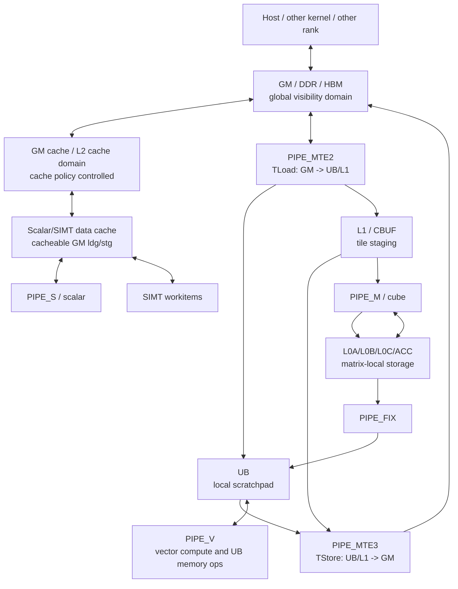

# PTOAS 自动同步内存一致性建模需求与设计说明

## 1. 背景

PTOAS 的自动同步当前主要围绕两类信息工作：

- op 所属的执行 pipe，例如 `PIPE_MTE2`、`PIPE_V`、`PIPE_MTE3`、`PIPE_S`。
- op 的 MemoryEffects 与 alias 关系，用于判断 RAW、WAR、WAW 数据依赖。

这套模型可以覆盖很多 tile op 的跨 pipe 数据依赖。例如 `TLOAD` 写入 UB 后由
vector op 读取，或者 vector op 写入 UB 后由 `TSTORE` 搬回 GM，PTOAS 可以根据
`MTE2 -> V`、`V -> MTE3` 的 pipe pair 生成 `set_flag/wait_flag`。

但是硬件的内存一致性要求并不只由 pipe 顺序决定。UB 和 GM 会被 AICore 的多个
组件访问，包括 scalar、SIMT/SIMD vector、MTE2、MTE3 等。尤其在 GM 访问中，
cacheable scalar/SIMT 访问、write-back/write-through 策略、DMA/MTE 访问和
跨 rank 通信信号之间存在额外的可见性约束。硬件资料中的 RAW/WAR/WAW consistency
表明确要求某些 hazard 除了 pipe sync 以外，还需要 `dcci`、`dsb`、`mem_bar`
或 pipe-local barrier。

### 1.1 Rank 与跨 rank 可见性

本文中的 rank 指通信语义中的一个逻辑参与者。它可以映射到不同 block、不同 AICore、
不同 device，或者 collective/remote communication runtime 中定义的 peer。对内存一致性
而言，关键不是 rank 的具体调度单位，而是 producer 和 consumer 是否处在同一个本地执行
与可见性域中。

如果 producer 和 consumer 在同一个本地 pipe/组件域内，某些 `pipe_barrier` 或
`set_flag/wait_flag` 可以保证本地执行顺序。例如本核的 `PIPE_MTE3` store 在本核后续
scalar signal store 之前被 drain。

但跨 rank 场景不同。producer rank 写 payload，随后写 signal；consumer rank 通过
`TWait` 观察 signal，再读取 payload。payload 和 signal 通常是两个不同地址，甚至可能
走不同的硬件路径：

```text
producer rank:
  payload write through MTE3/DMA
  signal write through scalar/comm path

consumer rank:
  wait signal
  read payload
```

这里的危险是：signal 对 consumer rank 可见，不代表 payload write 已经进入
consumer 能观察到的 GM/DDR visibility domain。也就是说，`pipe_barrier(PIPE_MTE3)`
只能说明本地 MTE3 pipe 不再继续乱序执行前面的 store，并不能自动推出 remote rank
之后的 load 一定能读到这笔 store 的结果。

### 1.2 Signal 与 payload

在通信同步语义里，payload 和 signal 是两个不同角色：

- Payload：真正要被 consumer 使用的数据，例如 `TSTORE` 写出的结果 tensor、通信 op
  写入的 GM 数据块、或者某个 rank 生产出的中间结果。
- Signal：用于通知 consumer “payload 已经可以被消费”的控制值，通常是一个较小的
  GM 标志位、计数器或状态字。`pto.comm.tnotify` 写 signal，`pto.comm.twait` 读
  signal 并等待其达到指定条件。

可以把 publish/consume 抽象成：

```text
producer rank:
  write payload_data
  make payload_data visible
  write signal

consumer rank:
  wait signal
  make payload_data observable
  read payload_data
```

在这个模型中，signal 不是 payload 本身。signal 只是控制路径上的“ready”标记。
payload 是数据路径上的真实数据。因此 payload buffer 和 signal buffer 通常不会 alias。
这也是为什么普通 MemoryEffects alias 分析无法自动发现
`payload write -> signal write` 这条依赖。

例如：

```cpp
// producer
TSTORE(payload_gm, ub_result);
pipe_barrier(PIPE_MTE3);
dsb(DSB_DDR);
pto::comm::TNOTIFY(signal_gm, 1, pto::comm::NotifyOp::Set);

// consumer
pto::comm::TWAIT(signal_gm, 1, pto::comm::WaitCmp::GE);
TLOAD(ub_result, payload_gm);
```

这里 `payload_gm` 和 `signal_gm` 是两个不同地址。`TWAIT` 返回只能说明 consumer
已经观察到 signal 条件满足；如果 producer 没有在写 signal 前做 release fence，
consumer 仍可能读不到最新 payload。

文中还会使用“signal”描述 `set_flag/wait_flag` 的 event signal。需要区分两类 signal：

- Pipeline event signal：`set_flag/wait_flag` 使用的 event id，用于本地 pipe 间顺序。
- Communication signal：`TNotify/TWait` 使用的 GM signal buffer，用于 rank 间
  publish/consume。

本文讨论跨 rank 可见性时，signal 默认指 communication signal。

### 1.3 与 CPU cache coherence 的类比

在常见 CPU 多核系统里，cacheable memory 通常由硬件 cache coherence 协议维护，例如
MESI/MOESI。一个 core 对 cacheable memory 的 store，即使先落在本 core cache 中，也会
通过 coherence 协议与其它 core 的 cache 状态建立一致性关系。程序通常仍然需要
release/acquire 或 fence 来建立顺序，但数据可见性本身是在统一 coherent memory model
下被硬件维护的。

一个典型 CPU publish/consume 例子是：

```cpp
payload = value;
flag.store(1, memory_order_release);

while (flag.load(memory_order_acquire) != 1) {}
use(payload);
```

release/acquire 建立 happens-before 后，consumer 看到 flag 时，也应看到 release 前的
payload write。

Ascend AICore 场景不能直接套用这个直觉。AICore 内部有 scalar、SIMT/SIMD vector、
MTE2/MTE3/DMA 等多个访问组件，UB/GM 也可能通过不同组件访问。硬件资料明确说明
UB 和 GM 被多个 AICore component 访问时不保证天然 cache coherence，尤其是
NDDMA/SIMT/SU 等对 UB/GM 的访问，需要 cache operation、memory barrier 或 pipe
synchronization 才能避免 data hazard。

因此，在 Ascend 上：

- `set_flag/wait_flag` 更偏向“执行 pipe 间顺序”。
- `pipe_barrier` 更偏向“本地 pipe drain/order”。
- `dcci` 处理 cache line 的 clean/invalidate 等 cache maintenance。
- `dsb(DSB_DDR)` 处理 GM/DDR visibility domain 的 release/acquire 类顺序。

跨 rank notify/wait 类似 CPU 的 flag publish/consume，但它不会自动继承 CPU coherent
cache 的语义。PTOAS 必须显式为 `payload write -> signal publish` 建模 release fence，
必要时也要为 `signal consume -> payload read` 建模 acquire fence。

### 1.4 抽象内存层级

下图是 PTOAS 做同步分析时需要区分的抽象层级。它不是某一代 Ascend 的完整物理结构图，
而是用于说明 consistency action 的作用边界：



因此需要区分几类边界：

- GM cacheable path 与 MTE/DMA/remote visibility path 之间，需要考虑 `dcci`、
  `dsb(DSB_DDR)` 或对应 cache-control/fence。
- UB 上的 V/S/SIMT memory op 之间，需要考虑 `mem_bar` 或 workitem fence。
- UB/L1/L0/ACC 这类片上 scratchpad/staging 数据流，通常是 pipe order、local barrier、
  bufid 或 event id 生命周期问题，不是 GM cache clean 问题。
- 纯寄存器计算没有 memory side effect，不应插入 memory consistency action。

### 1.5 建议学习路径

这些概念来自几层材料，建议按下面顺序补充：

1. PTOAS 自动同步模型。

   先阅读 `docs/designs/ptoas-auto-sync-design.md`，理解 InsertSync 如何从
   MemoryEffects、alias 和 pipe pair 生成 `set_flag/wait_flag/pipe_barrier`。
   这能解释“当前 PTOAS 已经解决了什么”。

2. PTO pipeline sync 与 UB memory barrier。

   阅读 `docs/isa/micro-isa/01-pipeline-sync.md`，重点看 `set_flag/wait_flag`、
   `pipe_barrier`、`get_buf/rls_buf`、`mem_bar`。这能解释 pipe 顺序同步和 UB
   memory barrier 的差异。

3. PTO/Ascend 硬件 memory consistency 表。

   这是 Ascend 特有约束的来源。重点看 GM/UB 的 RAW/WAR/WAW 表，理解为什么有些
   hazard 不能只插 event sync，还需要 `dcci`、`dsb`、`mem_bar` 或 pipe-local
   barrier。

4. PTO communication op。

   结合 `pto.comm.tnotify` / `pto.comm.twait` 的 op 定义、lowering 和 PTO-ISA
   实现，理解 signal buffer、wait condition、notify operation 以及内部是否已有
   release/acquire 语义。

5. CPU/C++ memory model。

   用 C++ `std::memory_order` 学习 release/acquire、happens-before 和 publish/consume
   的通用概念：https://en.cppreference.com/w/cpp/atomic/memory_order

6. Linux kernel memory barrier 文档。

   用它补充理解 compiler barrier、CPU barrier、cache coherence、DMA visibility
   之间的区别：https://www.kernel.org/doc/html/latest/core-api/wrappers/memory-barriers.html

学习时要注意：CPU 材料提供的是理解框架，不是 Ascend 的硬件规则。PTOAS 最终要遵守的
仍然是 Ascend 硬件 consistency 表和 PTO-ISA runtime 实现。

近期 issue #711 和 #744 暴露了这个缺口：

- #711：`pto.comm.tnotify` 的 signal store 发生在内部 trailing
  `pipe_barrier(PIPE_ALL)` 之前。若 `TNotify` 之前还有 pending MTE2/MTE3 操作，
  remote `TWait` 可能先看到 signal，再读取尚未完成的数据。
- #744：#711 补了 MTE pipe drain 后，跨 rank 场景仍然失败。原因是
  `pipe_barrier(PIPE_MTE3)` 只能约束本核 MTE3 pipe 的执行完成，不能等价保证
  前序 GM/DDR store 已经在 remote/DDR visibility domain 中可见。因此
  `TNotify` 前如果存在前序 MTE3 store，还需要 `dsb(DSB_DDR)` 作为 release fence。

这说明 `pipe + alias -> set/wait/barrier` 不足以完整表达硬件 memory consistency
contract。PTOAS 需要引入显式的内存一致性建模能力。

## 2. 问题陈述

当前 InsertSync 的核心问题是：同步分析只知道“哪个 pipe 读写了哪个 buffer”，
但不知道“这个访问通过哪种内存一致性路径完成”。

具体表现为：

1. Cache policy 没有进入依赖分析。

   例如 scalar/SIMT GM 访问可能是 cacheable、non-cacheable、write-back 或
   write-through。硬件表格中同样的 RAW/WAR/WAW hazard 在不同 cache policy 下
   需要不同动作。当前 MemoryEffects 只表达 Read/Write，不表达 cache policy。

2. 同一个 pipe pair 不一定对应同一种同步动作。

   `sync V -> MTE2` 可以表达 vector producer 和 MTE2 consumer 的执行顺序，但如果
   vector producer 是 write-back GM store，还可能需要 `simt.dcci` 或对应 cache
   maintenance。只插 event sync 不能保证 reader 看到最新数据。

3. Alias 粒度不覆盖硬件 hazard 粒度。

   对 scalar cacheable store，硬件 WAW hazard 可能以 64B scalar data cache line
   为冲突单位。当前 alias 分析更接近 buffer/range overlap，不会自动扩展到
   cacheline-level conflict。

4. Publish/consume 语义不是普通 alias 依赖。

   `TNotify` 的 signal buffer 和 payload buffer 通常不 alias。普通
   `payload write -> signal write` 依赖无法通过 MemoryEffects alias 直接发现。
   但通信语义要求 payload 在 signal 发布前可见。类似地，`TWait` 返回后是否需要
   acquire fence，也应由通信语义建模，而不是依赖 payload 与 signal 的地址关系。

5. Macro op 内部多组件访问难以被单 pipe 描述。

   `TPut/TGet/TGather/TScatter/TBroadcast/TReduce` 等复杂 op 可能在内部经过 MTE2、
   MTE3、V、S 等多个 component phase。若只把 op 建模成一个 pipe，就可能漏掉内部
   component 与外部 op 之间的 consistency action。当前 Sync Macro Model 已经为这些
   op 提供了 pipe/def-use/hidden-event 建模；后续仍需要将 phase 接入 access
   descriptor，使 TNotify release、UB `mem_bar` 或 GM cache action 能识别 macro
   内部真实访问路径。

## 3. 目标

本需求的目标是为 PTOAS 建立一套可扩展的自动内存一致性模型，使自动同步能够正确
处理硬件 RAW/WAR/WAW 表中要求的 pipe sync、cache maintenance 和 memory fence。

具体目标包括：

- 能区分 memory space：GM、UB 以及后续可能需要的 L1/L0/ACC 等空间。
- 能区分 access component：scalar、SIMT/SIMD vector、MTE2、MTE3、macro phase。
- 能区分 access kind：read、write、read-write、atomic、signal publish/consume。
- 能表达 cache policy：cacheable/non-cacheable、write-back/write-through、
  L1/L2 cache control 等。
- 能根据 hazard type：RAW、WAR、WAW 查表生成 action list。
- 能生成不止一种同步动作：`set_flag/wait_flag`、`pipe_barrier`、`mem_bar`、
  `dcci`、`dsb(DSB_DDR)` 等。
- 能将通信 op 的 publish/consume 语义独立建模，覆盖 payload 与 signal 不 alias 的场景。
- 能为 macro op 暴露内部 component phase，使外部同步分析可以看到真实访问路径。

## 4. 非目标

第一阶段不要求做到全局最优同步数量。

以下内容暂不作为首个实现阶段的目标：

- 精确消除所有由 consistency action 引入的冗余 fence。
- 完整处理所有硬件架构变体的所有特殊 cache policy。
- 对所有动态地址做完美 alias 证明。
- 替代现有 event id 分配和 RemoveRedundantSync 机制。
- 自动推断跨 rank 通信拓扑或 remote address ownership。

第一阶段应优先保证正确性，并让模型结构可扩展，后续再做精细化和性能优化。

### 4.1 不需要自动补 consistency action 的场景

为避免把问题范围扩大化，以下场景不应作为第一阶段自动插入 memory action 的目标：

- 纯寄存器计算，例如 vector register 到 vector register 的算术 op。
- 本地 MTE-only `TLoad/TStore` 数据流中的额外 cache clean。MTE/DMA 访问自身通常不
  需要 `dcci`；它仍然需要现有 pipe order 同步。
- 没有 memory alias、没有 publish/consume 语义、也没有共享资源生命周期的普通计算。
- 已经由库实现内部保证完成的封闭 macro op 内部同步。PTOAS 只需要为其外部可见
  def/use、hidden event id 和 publish/consume 边界建模。

## 5. 需求拆解

### 5.0 需要处理的问题类别

PTOAS 需要覆盖的 consistency 问题可以收敛成五类：

| 类别 | 典型动作 | 当前状态 |
| --- | --- | --- |
| 跨 pipe 执行顺序 | `set_flag/wait_flag`、`pipe_barrier` | 现有 InsertSync 主要覆盖 |
| UB/shared memory ordering | `mem_bar(VST_VLD)`、`mem_bar(ST_VLD)` 等 | 目前多为手写或模板插入，尚未统一自动生成 |
| GM cacheable path visibility | `dcci`、`dsb`、`threadfence`、cache-control | 尚未进入 InsertSync access model |
| Communication publish/consume | `TNotify` 前 release、`TWait` 后 acquire | 已局部覆盖 MTE2/MTE3 drain 与 MTE3 DDR release |
| Macro op 内部 phase | Sync Macro Model、hidden event reserve、phase descriptor | pipe/alias/event-id 已建模，memory descriptor 待扩展 |

### 5.1 访问描述模型

需要新增一个统一的 memory consistency access descriptor，作为 MemoryEffects
之外的补充信息。建议字段包括：

| 字段 | 说明 |
| --- | --- |
| `memorySpace` | GM、UB、L1、L0、ACC 等 |
| `component` | scalar、simt/simd vector、MTE2、MTE3、macro phase |
| `accessKind` | read、write、read_write、atomic、signal_publish、signal_consume |
| `cachePolicy` | cacheable、non-cacheable、write-back、write-through、L1/L2 控制 |
| `pipe` | 现有 `PIPE_*`，用于 event/barrier 生成 |
| `value` | 参与 alias 的 SSA value 或 memory region |
| `granularity` | byte range、cacheline、whole buffer、unknown |

MemoryEffects 继续用于发现读写对象和 alias；access descriptor 用于说明“这次访问的
硬件一致性属性”。

### 5.2 Hazard 判定

对于两个可能 alias 的访问，先按 MemoryEffects 判定 hazard type：

- prior write + later read：RAW。
- prior read + later write：WAR。
- prior write + later write：WAW。

再结合两个 access descriptor 查询 consistency matrix，得到需要生成的动作序列。

对于 `signal_publish/consume` 这类通信语义，不要求 payload 与 signal alias。
通信 op 应显式声明：

- publish 前需要哪些 producer access 可见。
- consume 后哪些 consumer access 需要 acquire 保证。

### 5.3 Action 表达

需要新增同步动作抽象，不能只把结果表示成 set/wait pair。

建议动作类型包括：

| 动作 | 示例 | 用途 |
| --- | --- | --- |
| pipe event | `set_flag(PIPE_V, PIPE_MTE3)` / `wait_flag(...)` | 跨 pipe 执行顺序 |
| pipe barrier | `pipe_barrier(PIPE_MTE3)` | 同 pipe drain/order |
| memory barrier | `mem_bar(VST_VLD)` 等 | SIMD/UB 内存顺序 |
| cache maintenance | `dcci(...)` | cache line clean/invalidate |
| DDR fence | `dsb(DSB_DDR)` | GM/DDR visibility release/acquire |
| architecture fallback | `pipe_barrier(PIPE_ALL)` | 无法精确建模时的保守兜底 |

动作需要携带 insertion point、target value/range、以及是否可以被冗余删除的信息。

### 5.4 Matrix 驱动

硬件 RAW/WAR/WAW consistency 表应转换成 PTOAS 内部的 matrix。matrix 输入为：

```text
memorySpace
hazardType
priorAccess(component, accessKind, cachePolicy)
laterAccess(component, accessKind, cachePolicy)
```

matrix 输出为：

```text
ordered action list
```

例如：

```text
GM + RAW + prior MTE3 write + later scalar read
  -> pipe/order action if needed
  -> scalar cache action if required by later access policy

GM + publish + prior MTE3 write + TNotify
  -> pipe_barrier(PIPE_MTE3)
  -> dsb(DSB_DDR)
```

具体表项需要与硬件团队确认后固化，并按架构版本区分。

### 5.5 通信 publish/consume

`TNotify/TWait` 需要从普通 op pipe 模型中独立出来，作为通信同步语义处理。

Producer 侧：

```cpp
payload write
release actions
TNotify(signal)
```

已知需要覆盖：

- pending MTE2：`pipe_barrier(PIPE_MTE2)`。
- pending MTE3：`pipe_barrier(PIPE_MTE3); dsb(DSB_DDR)`。
- scalar/SIMT/SIMD GM write：需要按 cache policy 查询 matrix，决定是否补
  `dcci`、`dsb` 或其它 fence。
- macro op 内部 MTE2/MTE3 phase：`TNotify` release 分析不能只看 op 自身的 pipe，
  还应识别 Sync Macro Model 暴露的 phase。

Consumer 侧：

```cpp
TWait(signal)
acquire actions
payload read
```

需要确认 `TWAIT_IMPL` 或硬件 wait 是否已经提供 acquire 语义。如果没有，需要为
`TWait -> GM read` 建模 acquire fence。

当前实现状态：

| 场景 | 当前支持情况 |
| --- | --- |
| `TNotify` 前存在 pending MTE2 | 已支持，插 `pipe_barrier(PIPE_MTE2)` |
| `TNotify` 前存在 pending MTE3 | 已支持，插 `pipe_barrier(PIPE_MTE3); dsb(DSB_DDR)` |
| `TNotify` 前存在 scalar/SIMT cacheable GM store | 未支持，需要 access descriptor 与 cache action |
| `TNotify` 前存在 macro op 内部 MTE2/MTE3 phase | 当前可能未覆盖，需要让 release scan 识别 Sync Macro Model |
| `TWait` 后 payload read 的 acquire 语义 | 待硬件/runtime 确认 |

### 5.6 Macro op 建模

对于内部包含多个 component phase 的 op，应通过 Sync Macro Model 暴露内部访问。当前
PTOAS 已经为已知通信和复杂 tile op 建立了基础模型：

```text
phase 0: MTE2 read/write staging
phase 1: V/S compute or index generation
phase 2: MTE3 writeback
hidden events / reserved event ids
```

已完成的部分包括：

- `TPut/TGet/TGather/TScatter/TBroadcast/TReduce` 等 comm macro 的 MTE2/MTE3/V phase。
- indexed `TScatter` 与 compare `TGather` 等特殊 lowering 的 V/S phase。
- macro 内部固定或 hidden event id 的 reserve，避免外部自动分配 event id 冲突。

仍需扩展的部分包括：

- 每个 phase 都应带 access descriptor，而不只是 def/use。
- `TNotify` release 分析应能识别 macro phase 中的 MTE2/MTE3。
- 如果某个 macro 内部未来引入 scalar/SIMT cacheable GM path，需要能触发对应
  `dcci/dsb/threadfence`。
- 如果 macro 内部 V/S phase 的 UB hazard 不由库实现自行保证，则需要在展开或
  consistency matrix 中生成 `mem_bar`。

### 5.7 分层建模原则

PTOAS 不应把所有内存一致性能力都塞进现有 InsertSync。现有 InsertSync 主要负责
pipe order 和 event id 生命周期；新增内存一致性能力应作为独立 descriptor/pass
接入，并根据 action 类型决定最终生成方式。

建议分层如下：

```text
pipe synchronization:
  set_flag / wait_flag / pipe_barrier

memory consistency:
  load/store cache policy
  cache-control action
  memory fence action
```

能附着在访存指令上的一致性语义，优先作为 access policy 或 attribute 表达。例如
scalar GM load 可以被改写为 uncache load，scalar GM store 可以携带 L1/L2 cache
policy。必须独立执行的一致性动作，则作为显式 action 表达，例如 `dcci`、
`dsb(DSB_DDR)`、`mem_bar`。

因此，PTOAS 的长期形态应是：

- InsertSync 继续负责 pipe event、event id 分配和 event/barrier 冗余删除。
- Memory consistency pass 根据 access descriptor 和 consistency matrix 生成
  `ldg.uncache`、`dcci`、`dsb(DSB_DDR)`、`mem_bar` 等动作。
- lowering/codegen 根据动作类型决定是改写访存 cache policy，还是插入显式指令。

这样可以避免把 `set_flag/wait_flag` 语义过度扩张，也能让不同类型的一致性动作拥有
独立的移动、合并和冗余删除规则。

### 5.8 不需要重写所有 PTO OP

内存一致性建模不应要求一次性重写所有 PTO OP。第一阶段应采用“默认推导 + 少量特化”：

```text
collectMemoryAccessDescs(op):
  if op implements precise memory consistency model:
    use precise descriptors
  else if op has MemoryEffectsOpInterface and OpPipeInterface:
    derive read/write objects from MemoryEffects
    derive pipe from OpPipeInterface
    derive memory space from operand type when possible
  else:
    do not participate in memory consistency pass
```

大多数普通 tile compute op 只读写本地 tile buffer，不涉及 GM cache visibility、
communication signal 或 macro 内部隐藏访问。它们可以继续只依赖现有
MemoryEffects/alias/pipe 模型，不需要新增手写 descriptor。

第一批需要精确建模的 op 主要是：

- `pto.tload` / `pto.tstore`：MTE/DMA 方式访问 GM。
- `pto.ldg` / `pto.stg`：scalar/SIMT GM 访问，带 L1/L2 cache policy。
- `pto.comm.tnotify` / `pto.comm.twait`：communication signal publish/consume。
- 已知 macro op：`TPut/TGet/TGather/TScatter/TBroadcast/TReduce` 等，通过
  Sync Macro Model 暴露内部 phase。

对于没有特化但访问 GM 的未知 op，可以先在 debug/diagnostic 模式下提示缺少
memory consistency descriptor；必要时使用保守 fallback。这样既能保证模型可扩展，
又不会把第一阶段实现变成全量 OP 改造。

### 5.9 TLoad/TStore 首批改造示例

`TLoad` 和 `TStore` 是最适合作为首批 descriptor 的 op，因为它们语义稳定、硬件通路明确，
且正好覆盖 MTE2/MTE3 与 GM visibility 的核心边界。

当前模型中，PTOAS 主要看到：

```text
TLoad:
  pipe = PIPE_MTE2
  MemoryEffects = Read(src), Write(dst)

TStore:
  pipe = PIPE_MTE3 or PIPE_FIX
  MemoryEffects = Read(src), Write(dst)
```

改造后，`TLoad` 应产生两个 access descriptor：

```text
TLoad read:
  value = src partition view
  memorySpace = GM
  accessKind = read
  component = MTE2
  pipe = PIPE_MTE2
  cachePolicy = dma/non-cacheable
  visibility = DDR/GM domain

TLoad write:
  value = dst tile buffer
  memorySpace = local tile space
  accessKind = write
  component = MTE2
  pipe = PIPE_MTE2
  visibility = core-local
```

`TLoad` 自身通常不需要 `dcci`，因为 MTE2/DMA 读 GM 不通过 scalar data cache。但如果
前序 producer 是 cacheable scalar/SIMT GM store，且与 `TLoad` 的 GM source alias，
则需要在 `TLoad` 前对 producer 侧补 clean/writeback 与 DDR fence，确保 MTE2 能从
GM/DDR 读到最新数据。

例如：

```text
pto.stg l1cache(cache) payload_gm
pto.tload payload_gm -> tile
```

应由 consistency pass 生成：

```text
pto.stg l1cache(cache) payload_gm
dcci clean/writeback payload_gm
dsb(DSB_DDR)
pto.tload payload_gm -> tile
```

`TStore` 应产生两个 access descriptor：

```text
TStore read:
  value = src tile buffer
  memorySpace = local tile space
  accessKind = read
  component = op.getPipe()
  pipe = op.getPipe()
  visibility = core-local

TStore write:
  value = dst partition view
  memorySpace = GM
  accessKind = write
  component = op.getPipe()
  pipe = op.getPipe()
  cachePolicy = dma/non-cacheable
  visibility = DDR/GM domain
```

`TStore` 也通常不需要 `dcci`，因为 MTE3/FIX 写 GM 不会产生 scalar dcache dirty line。
但如果后续 `TNotify` 发布 signal，则需要在 signal 前 drain 实际执行该 store 的 pipe，
再做 DDR release fence：

```text
pto.tstore tile -> payload_gm
pipe_barrier(op.getPipe())   // PIPE_MTE3 or PIPE_FIX
dsb(DSB_DDR)
pto.comm.tnotify signal_gm
```

这里必须使用 `op.getPipe()`，不能固定写成 `PIPE_MTE3`。例如 ACC/L0C 源的 `TStore`
可能通过 `PIPE_FIX` 完成 GM write；release fence 前应 drain 实际 producer pipe。

因此，`TLoad/TStore` 的改造不是重写 OP 定义，而是在 memory consistency collector 中
增加两个精确 special case。它们继续服务现有 InsertSync 的 pipe/alias 分析，同时为新增
consistency pass 提供 GM/local、DMA/cache policy 和 publish/release 所需信息。

## 6. 对现有 PTOAS 的影响

### 6.1 IR / Op 定义

需要逐步为相关 op 补充一致性 metadata，但不要求一次性重写所有 PTO OP。建议优先通过
C++ collector 从现有 MemoryEffects、OpPipeInterface 和 operand type 中默认推导，
只对高风险 op 实现精确 special case 或后续接口。

需要优先覆盖：

- scalar GM load/store/atomic。
- SIMT/SIMD GM load/store/atomic。
- MTE2/MTE3 tile load/store。
- `pto.comm.*` 通信 op。
- macro op：`TPut/TGet/TGather/TScatter/TBroadcast/TReduce` 等。

这些 metadata 可以先在 C++ helper 中推导，后续再视需要暴露成 op interface。普通本地
tile compute op 若不涉及 GM cache visibility、communication signal 或 macro phase，
可以继续使用默认推导结果，不需要额外改动。

### 6.2 SyncIR 翻译

`PTOIRTranslator` 当前从 MemoryEffects 提取 def/use，并从 OpPipeInterface 提取 pipe。
后续需要额外提取 access descriptor，存入 `CompoundInstanceElement` 或并行 side table。

### 6.3 InsertSyncAnalysis

依赖判断不再只返回“需要 sync 或不需要 sync”，而应返回一个 action request：

```text
hazard
prior access
later access
required actions
```

event sync 只是 action list 的一种结果。

### 6.4 Move / RemoveRedundantSync

同步移动和冗余删除需要知道 action 类型：

- event pair 可以继续按 pipe pair 与 must-path 规则删除。
- `dsb/dcci/mem_bar` 不能随意按 pipe pair 删除。
- publish/consume fence 需要保持在 signal op 附近，不能被普通 alias sync 吞掉。

### 6.5 EventIdAllocation

event id 分配只处理 event action。`dsb/dcci/mem_bar/pipe_barrier` 不应占用 event id。
但 macro op 内部固定 event id 或 reserved event id 仍需保持现有隔离机制。

### 6.6 Codegen

`SyncCodegen` 或 EmitC lowering 需要支持输出多种 action：

- `set_flag/wait_flag`
- `pipe_barrier`
- `mem_bar`
- `dcci`
- `dsb(DSB_DDR)`

对于 `TNotify` 这类 op-local publish action，可以继续在 EmitC 阶段插入；长期建议将其
前移到统一 action model 中。

## 7. 分阶段实施计划

### 阶段 1：文档与需求确认

- 将硬件 RAW/WAR/WAW 表整理成 PTOAS 内部需求。
- 与硬件团队确认每个表项的动作语义、作用域和架构差异。
- 明确 `TWait` 是否自带 acquire 语义。

### 阶段 2：TNotify publish 补齐

- 已覆盖 MTE2/MTE3 pending drain。
- 已覆盖 MTE3 publish 前 `dsb(DSB_DDR)`。
- 补齐 macro op 内部 MTE2/MTE3 phase 的 pending drain 识别。
- 继续补齐 scalar/SIMT/SIMD GM write -> TNotify 的 release action。

### 阶段 3：Access Descriptor 基础设施

- 为关键 op 建立 access descriptor。
- 在 SyncIR 翻译阶段携带 descriptor。
- 保持旧 event sync 逻辑兼容。

### 阶段 4：Matrix-driven action 生成

- 将 GM/UB RAW/WAR/WAW 表转换成内部 matrix。
- 先覆盖高风险路径：GM cacheable scalar/SIMT、MTE3、MTE2、V/S。
- 增加 lit 回归和板级验证用例。

### 阶段 5：优化与冗余删除

- 对 `dsb/dcci/mem_bar` 做 must-path 冗余删除。
- 对重复 publish fence 做合并。
- 将保守 fallback 逐步替换成精确 action。

## 8. 风险与取舍

- 正确性风险：如果 action 表项缺失或 op metadata 错误，仍可能漏同步。
- 性能风险：第一阶段保守插入 `dsb/dcci` 可能增加同步开销。
- 编译复杂度：同步分析从 pipe pair 扩展为 matrix-driven，会增加实现和调试复杂度。
- 维护成本：硬件表格变化时，需要同步更新 PTOAS matrix 和测试。

建议以正确性优先，先在高风险通信和 GM cacheable 场景补齐，再逐步优化冗余。

## 9. 验证需求

需要新增以下类型测试：

- `MTE3 store -> TNotify`：检查 `pipe_barrier(PIPE_MTE3); dsb(DSB_DDR)`。
- `MTE2 load -> TNotify`：检查不插 DDR fence。
- `macro MTE3 phase -> TNotify`：检查 release scan 能识别 Sync Macro Model phase。
- `scalar cacheable GM store -> scalar/SIMT/MTE read`：检查 `dcci/dsb`。
- `SIMT write-back GM store -> MTE2/scalar read`：检查 cache maintenance。
- `UB SIMD write -> SIMD read/write`：检查 `mem_bar`。
- scalar cacheline WAW：两个 store 地址不同但落在同一 64B cacheline 时仍触发 hazard。
- `TWait -> payload read`：根据 acquire 语义确认是否需要 fence。
- macro op 内部 phase 与外部 GM/UB access 的 consistency action。

板级验证应覆盖跨 rank notify/wait 场景，尤其是 payload 和 signal 不 alias 的 publish/consume。

## 10. 当前结论

PTOAS 现有自动同步模型解决了大部分“同一 buffer 上跨 pipe 的执行顺序”问题，但不能完整
覆盖硬件 memory consistency contract。后续需要把自动同步从单一的 event/barrier 模型
扩展为：

```text
alias/memory-effect analysis
  + access descriptor
  + RAW/WAR/WAW consistency matrix
  + communication publish/consume semantics
  -> ordered action list
```

#744 中 `TNotify` 前补 `dsb(DSB_DDR)` 是该模型的一个具体特例。完整方案需要进一步
覆盖 cache maintenance、memory barrier、cacheline-level hazard 和 macro-op 内部访问。
